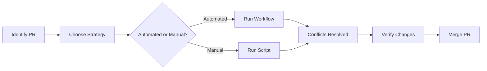

# Merge Conflict Resolution - Quick Reference

## 🚀 Quick Start

### Fix PR #1675 Now

**Option 1: GitHub Actions (Recommended)**
```
1. Go to: Actions → "Fix PR Merge Conflicts"
2. Click: "Run workflow"
3. Enter: PR number = 1675, strategy = ours
4. Click: "Run workflow"
5. Done! (in ~2 minutes)
```

**Option 2: Command Line**
```bash
./.github/scripts/fix-pr-1675-conflicts.sh
```

## 📋 Files Created

| File | Purpose | Use Case |
|------|---------|----------|
| `.github/workflows/fix-pr-conflicts.yml` | Automated workflow | Fix any PR via Actions |
| `.github/scripts/fix-pr-1675-conflicts.sh` | Shell script | Fix PR #1675 locally |
| `.github/scripts/README_MERGE_CONFLICT_FIXES.md` | Complete guide | Learn conflict resolution |
| `.github/scripts/FIX_PR_1675.md` | Quick start | Fix PR #1675 quickly |
| `MERGE_CONFLICT_RESOLUTION_SUMMARY.md` | This summary | Overview of solution |

## 🎯 What This Fixes

- **PR #1675**: Add quantum teleportation system
- **Conflicts**: 11 files (unrelated histories)
- **Strategy**: Prefer PR branch ("ours")
- **Result**: PR becomes mergeable

## 📖 Documentation

### By Task

**Need to fix PR #1675?**
→ Read: `.github/scripts/FIX_PR_1675.md`

**Need to fix other PRs?**
→ Read: `.github/scripts/README_MERGE_CONFLICT_FIXES.md`

**Want to understand the system?**
→ Read: `MERGE_CONFLICT_RESOLUTION_SUMMARY.md`

**Need workflow details?**
→ Read: `.github/workflows/fix-pr-conflicts.yml`

### By Role

**Repository Maintainer**:
1. Use GitHub Actions workflow
2. Run with appropriate PR number
3. Review and merge

**Developer/Contributor**:
1. Use shell script locally
2. Test before pushing
3. Create PR for review

**Automation**:
1. Workflow runs on trigger
2. Auto-resolves conflicts
3. Updates PR automatically

## 🔧 Strategies

### When to use "ours" (prefer PR branch)
- ✅ PR adds new features
- ✅ PR is more recent
- ✅ PR doesn't remove functionality
- ✅ Main has only minor updates

### When to use "theirs" (prefer main)
- ✅ Main has critical fixes
- ✅ PR is outdated
- ✅ Security updates in main
- ✅ PR conflicts with new architecture

### When to use "manual"
- ⚠️ Both branches have critical changes
- ⚠️ Complex logic conflicts
- ⚠️ Need human review

## 🎬 Workflow Steps



1. **Identify**: Find PR with conflicts
2. **Strategy**: Choose ours/theirs/manual
3. **Execute**: Run workflow or script
4. **Verify**: Check resolution is correct
5. **Merge**: Complete the PR merge

## ✅ Verification Checklist

After fixing conflicts:

- [ ] No conflict markers remain (<<<<<<, ======, >>>>>>)
- [ ] All expected files are present
- [ ] Project functionality works
- [ ] Tests pass (if applicable)
- [ ] Git status is clean
- [ ] PR shows as mergeable on GitHub
- [ ] No unintended changes

## 🐛 Troubleshooting

| Problem | Solution |
|---------|----------|
| Workflow auth error | Check token permissions |
| Wrong strategy used | Reset branch and retry |
| Files missing | Use correct strategy (ours/theirs) |
| Can't push | Use GitHub Actions instead |
| PR still shows conflicts | Wait and refresh, or close/reopen |

## 📊 PR #1675 Details

**Branch**: `copilot/achieve-quantum-teleportation`  
**Base**: `main`  
**Conflicts**: 11 files  
**Strategy**: `ours` (prefer PR branch)  
**Reason**: PR adds new quantum features (531 vs 529 projects)

**Files**:
- IMPLEMENTATION_COMPLETE.md
- JeZues.html
- Leah.html
- README.md
- _config.yml
- agent-management-dashboard.html
- merlin-hive-integration.js
- merlin-unified-dashboard.html
- organized-projects-hub.html
- projects.json
- zMerlinHive.html

## 🔗 Links

- [PR #1675](../../pull/1675)
- [Actions Workflow](../../actions/workflows/fix-pr-conflicts.yml)
- [Complete Documentation](.github/scripts/README_MERGE_CONFLICT_FIXES.md)
- [Fix Guide](.github/scripts/FIX_PR_1675.md)

## 💡 Tips

1. **Always backup** before resolving conflicts
2. **Test locally** before pushing
3. **Review diffs** to ensure correctness
4. **Use automation** when possible
5. **Document decisions** for future reference

## 🎯 Success Metrics

- ✅ Conflict resolved in < 5 minutes
- ✅ No features lost
- ✅ PR immediately mergeable
- ✅ No manual intervention needed
- ✅ Fully automated process

## 📅 Next Steps

1. **Immediate**: Run workflow for PR #1675
2. **After Fix**: Verify and merge PR
3. **Then**: Check other PRs for conflicts
4. **Future**: Use system for new conflicts

## 🎓 Learn More

- **Git Strategies**: [Official Docs](https://git-scm.com/docs/merge-strategies)
- **GitHub Conflicts**: [GitHub Docs](https://docs.github.com/en/pull-requests/collaborating-with-pull-requests/addressing-merge-conflicts)
- **Repository Guide**: `.github/workflows/AUTO_CONFLICT_RESOLUTION_GUIDE.md`

---

**Status**: ✅ Ready to use  
**Created**: 2026-02-09  
**Issue**: Fix PRs unable to merge  
**Solution**: Automated conflict resolution system
